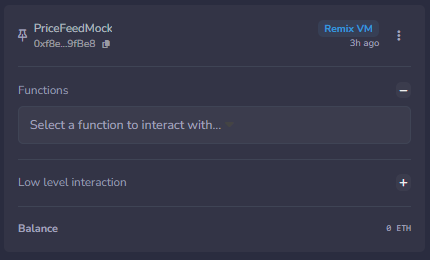

## NOTE DE DÉPLOIEMENT — BILLETCHAIN
### 1. Le choix du réseau de test

Je choisis le réseau Remix VM avec l'emplacement "Osaka".
Pourquoi ? C'est un réseau fonctionnel et definie par defaut dans Remix IDE.

### 1. Les valeurs pour la création (le Constructeur)
Quand je clique sur Deploy dans Remix, je remplis les 3 cases comme ça :

- _maxTickets : 20 (pour bloquer la vente à 20 places max).
- _ticketPriceEUR : 20 (pour fixer le prix de base à 20 €).
- _oracleAddress : 0xf8e81D47203A594245E36C48e151709F0C19fBe8 (l'adresse magique de l'oracle).

### 3. Où trouver l'adresse de l'oracle de taux ?

Je vais sur Remix IDE. J'accède à la page de deploiement et je regarde le deploiement de PriceFeedMock. 

Dans la section "Deployed Contracts", il y a les infos du contrat.


Je copie l'adresse en dessous du nom du contrat et je l'utilise dans **_oracleAddress**.

### 4. Utilisation du site
1. Osaka + Account 1
2. Deploy PriceFeedMock
3. Deploy BilletChain (20,20,id PriceFeedMock)
4. Account 2
5. Function buyTicket (200)
6. Function tickets (1)
7. Function putTicketOnSale (1, 210)
8. Account 3
9. Function buySecondHandTicket (1) (value: 210)
10. Account 2
11. Function claimEarnings ()

### 5. Effectuer les tests
1. Lancer Foundry
```bash
cd test/
docker compose -p "foundry" up -d
```
2. Lancer le Tests
```bash
docker compose -p "foundry" exec foundry forge test -vvv
```

### *Doc créé sans IA par Morgan SECRETIN (moi UwU). L'IA Gemini a aidé pour lancer Foundry et pour la revue de code. (et un peu les ecrits théorie mais revue et check de mon coté)*
